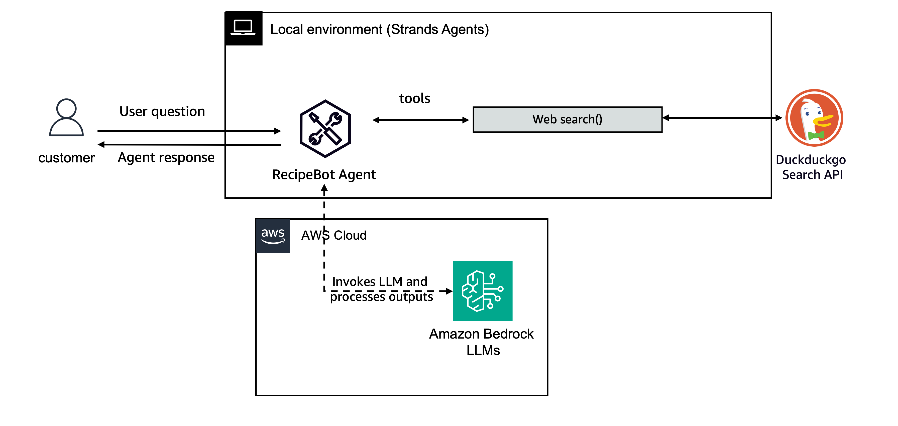

Here's a practical example of a task-specific agent. Here we create a RecipeBot that recommends recipes and answers any cooking related questions.

First we install the duckduckgo-search  package for a free and opensource web-search API.

pip install duckduckgo-search

